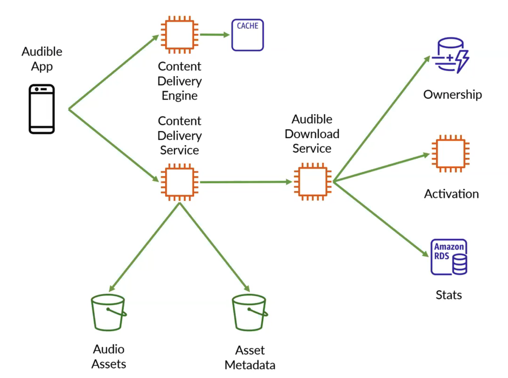
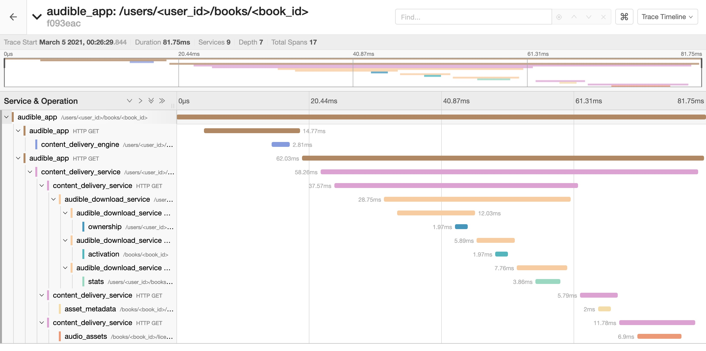

# Services

### Audible App
port 5000  
`GET /users/<user_id>/books/<book_id>`  
return audio file with metadata  
or 404 NotFound (if user_id/book_id not found)  
or 403 Forbidden (if user_id does not own book_id)  
or 503 ServiceUnavailable (if CDE/CDS is unavailable or timed out)
or 500 InternalServerError

### Content Delivery Engine
port 5001  
`GET /users/\<user_id\>/books/\<book_id\>`  
return url to CDS (string in json field "url")  
or 404 NotFound (if book_id not found)

### Content Delivery Service
port 5002  
`GET /users/\<user_id\>/books/\<book_id\>`  
return audio file with metadata  
or 404 NotFound (if user_id/book_id not found)  
or 403 Forbidden (if user_id does not own book_id or license invalid)  
or 503 ServiceUnavailable (if ADS is unavailable)  
or 500 InternalServerError

### Audible Download Service
port 5003  
`GET /users/\<user_id\>/books/\<book_id\>`  
return license (string in json field "license")  
or 404 NotFound (if user_id/book_id not found)  
or 403 Forbidden (if user_id does not own book_id)  
or 503 ServiceUnavailable (if Ownership/Activation service is unavailable)  
or 500 InternalServerError (if failed to parse a response)

### Ownership
port 5004  
`GET /users/\<user_id\>/books/\<book_id\>`  
return 200 OK (if valid ownership)  
or 404 NotFound (if user_id not found)  
or 403 Forbidden (if user_id does not own book_id)

### Activation
port 5005  
`GET /books/\<book_id\>`  
return license (string in json field "license")  
or 404 NotFound (if book_id not found)

### Stats
port 5006  
`POST /users/\<user_id\>/books/\<book_id\>`  
return 201 Created  
or 500 InternalServerError

### Asset Metadata
port 5007  
`GET /books/\<book_id\>/licenses/\<license\>`  
return json (containing bookname and numChapters)  
or 404 NotFound (if book_id not found)  
or 403 Forbidden (if license invalid)

### Audio Assets
port 5008  
`GET /books/<book_id>/licenses/<license>`  
return audio file    
or 404 NotFound (if book_id not found)  
or 403 Forbidden (if license invalid)

# Sample Jaeger Trace
